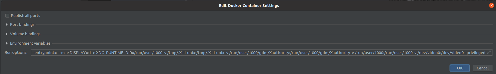

[<-- Home](/)

# TEK 5030 - Getting started with dev containers

This is a quick and dirty howto for getting started with the _Docker toolchain_ in CLion. YMMV!


### Prerequisites

- Have Docker installed and know how to use it.   
  https://docs.docker.com/engine/install/ubuntu/

- Familiarize yourself with _Docker toolchain_ in CLion, as described in the official documentation   
  https://www.jetbrains.com/help/clion/clion-toolchains-in-docker.html

- Pull the tek5030 docker image  

  ```bash
  docker pull tek5030/dev-container:latest
  ```

### Setup the toolchain

- Create the toolchain as described in the [video].

- Execute this command in a terminal

   ```bash
   echo "--entrypoint= --rm" \
   "-e DISPLAY=${DISPLAY}" \
   "-e XDG_RUNTIME_DIR=${XDG_RUNTIME_DIR}" \
   "-v /tmp/.X11-unix:/tmp/.X11-unix" \
   "-v $XAUTHORITY:$XAUTHORITY" \
   "-v $XDG_RUNTIME_DIR:$XDG_RUNTIME_DIR" \
   "-v /dev/video0:/dev/video0" \
   "--privileged"
   ```

   expect some output similar to this:

   ```
   --entrypoint= --rm -e DISPLAY=:1 -e XDG_RUNTIME_DIR=/run/user/1000 -v /tmp/.X11-unix:/tmp/.X11-unix -v /run/user/1000/gdm/Xauthority:/run/user/1000/gdm/Xauthority -v /run/user/1000:/run/user/1000 -v /dev/video0:/dev/video0 --privileged
   ```

   _If your camera is not at index `0`, you must change `/dev/video0` to the corresponding index._

- Copy the output from the previous command and paste it in the _Run options_ in the Docker container settings

   

- Create the Docker CMake configuration as described in the [video].

### Compile and run the labs

That's it! (?)

---

[<-- Home](/)

[video]: https://www.jetbrains.com/help/clion/clion-toolchains-in-docker.html