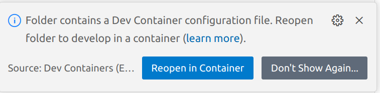
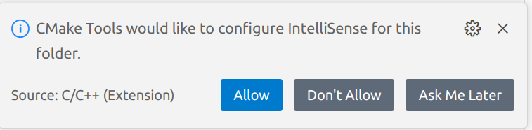

[<-- Home](/)

# TEK 5030 - Getting started with VS Code devcontainer

This is a quick and dirty howto for getting started with developing inside a _devcontainer_ in VS Code. YMMV!

### Prerequisites

- Have Docker installed and know how to use it.   
  https://docs.docker.com/engine/install/ubuntu/

- Familiarize yourself with _devcontainers_ in VS Code, as described in one of the official documentations   
  https://code.visualstudio.com/docs/devcontainers/containers

- Pull the tek5030 docker image  

  ```bash
  docker pull tek5030/devcontainer:latest
  ```

### Setup the toolchain

When you open the project in VS Code, a dialog box should appear, since the `.devcontainer` directory is detected:



Press **Reopen in Container**. It may take a while the first time.

_After reopening_, you may press **Allow** (or any of the other options) in the other dialog box, if it appears:




### Compile and run the labs

Now you can proceed to build and run the lab as usual!

All the magic and required settings is hidden within `.devcontainer/devcontainer.json`.

(In this bare minimum guide it is assumed that you are fairly fluent in vs code).


---

[<-- Home](/)


